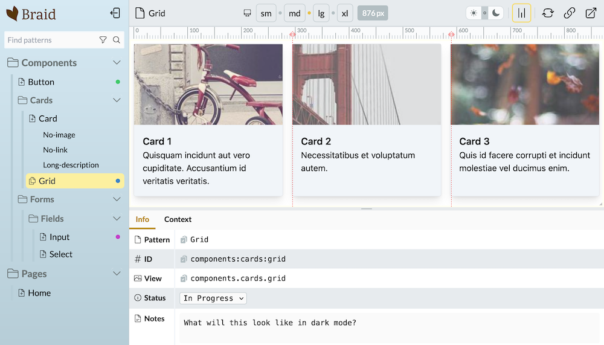

# Braid

<picture>
  <source media="(prefers-color-scheme: dark)" srcset="docs/assets/screens/overall-shot-dark.png">
  <source media="(prefers-color-scheme: light)" srcset="docs/assets/screens/overall-shot.png">
  
</picture>

## What is Braid?
Braid is a pattern library tool for Laravel (+ Livewire) projects.

It enables developers to view components and markup in isolation, allowing for a consistent, clutter-free view of the atomic structure of their layouts.

## Installing Braid
Braid can be installed via [Composer](https://getcomposer.org):

```
$ composer require njpanderson/braid
```

## Documentation
See the [Braid documentation](https://njpanderson.github.io/braid/) for more information.
